> **🇬🇧 English** | [🇷🇺 Русский](../ru/usage.md)

[← Getting Started](getting-started.md) · [🏠 README](../../README.md) · [Configuration →](configuration.md)

# Usage Guide

Relix guides you through a structured, multi-step release process:

**Home → Select MRs → Choose Environment → Set Version → Source Branch → Env Merge → Root Merge → Confirm → Release**

Each step is its own screen with a dedicated UI. Previous selections are always visible in the left sidebar so you can review your choices at any point.

---

## 1. Home Screen

After authentication and project selection, you land on the Home screen. It displays the Relix logo, the current version, and the main action menu:

- **`r`** -- Start a new **Release**
- **`h`** -- View **Releases history**
- **`s`** -- Open **Settings**

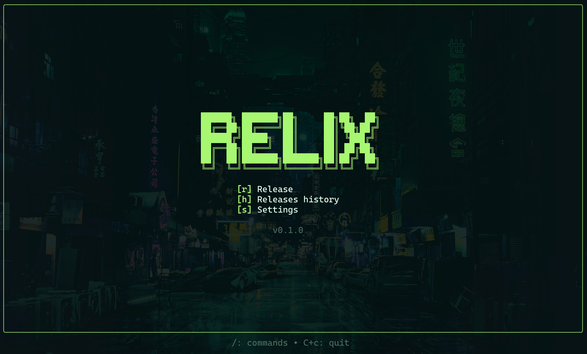

### Command Menu

Press **`/`** at any time (except the auth screen) to open the Command Menu. It provides quick access to:

- **project** -- Switch the active GitLab project
- **settings** -- Open application settings
- **logout** -- Clear credentials and re-authenticate

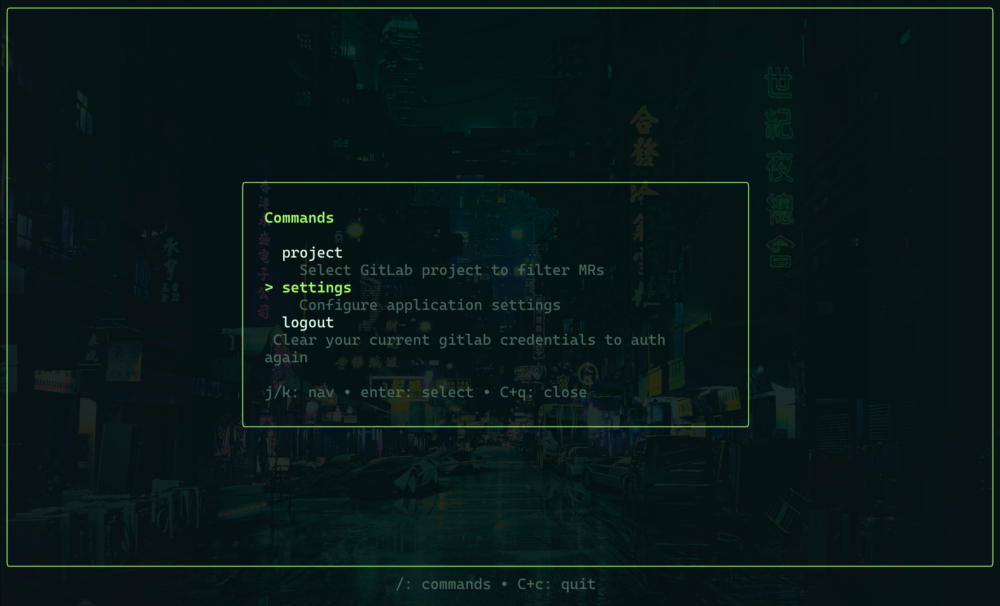

---

## 2. Select Merge Requests

The MR selection screen shows all open Merge Requests for the current project. The left pane lists MRs, and the right pane displays details for the highlighted MR -- including the description, diff stats (files changed, insertions, deletions), commit count, and discussion threads.

Conflict detection is built in: MRs with merge conflicts are flagged so you know before starting the release.

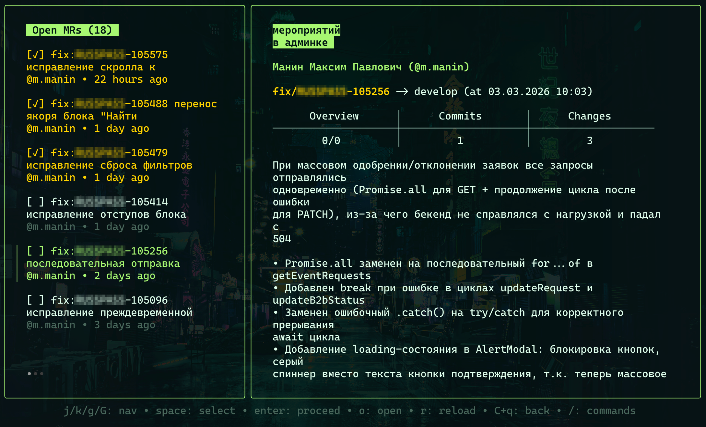

### Key Bindings

| Key | Action |
|-----|--------|
| `j` / `k` or `Up` / `Down` | Navigate the MR list |
| `Space` | Toggle selection on the highlighted MR |
| `Enter` | Confirm selection and proceed to the next step |
| `o` | Open the highlighted MR in your browser |
| `r` | Refresh the MR list from GitLab |
| `d` / `u` | Scroll the details pane down / up |

Select one or more MRs by pressing `Space`, then press `Enter` to continue. The selected MR branches will be merged together during the release process.

---

## 3. Choose Environment

Select the target environment for the release. Each environment maps to a specific Git branch. The release branch name is previewed at the bottom, incorporating the version and environment.

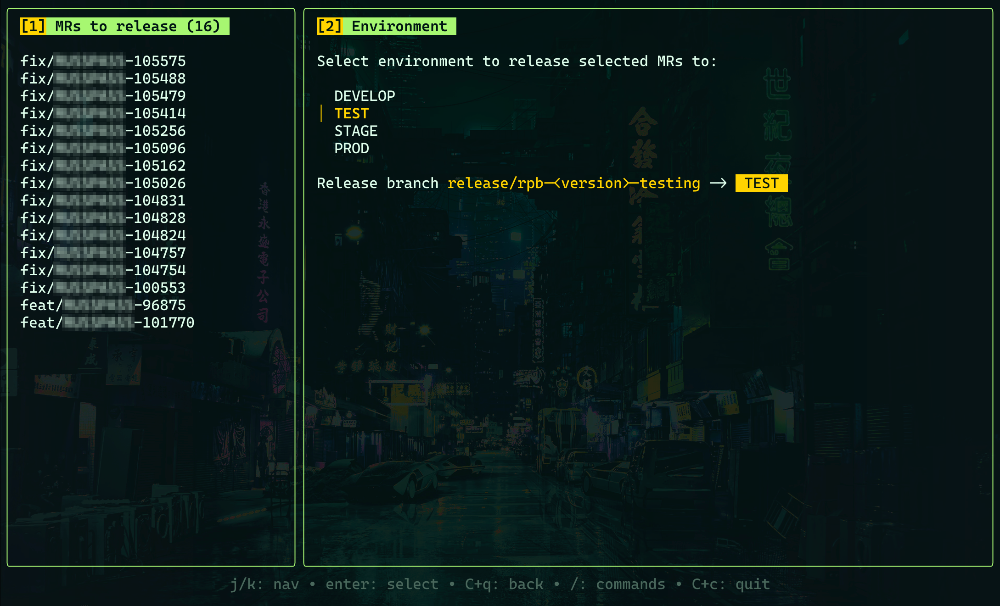

### Default Environments

| Environment | Branch |
|-------------|--------|
| DEVELOP | `develop` |
| TEST | `testing` |
| STAGE | `stable` |
| PROD | `master` |

Environment names and their branch mappings are fully customizable in [Settings](configuration.md#environments). Use `j` / `k` or arrow keys to navigate and `Enter` to select.

---

## 4. Versioning

Enter a semantic version number for the release (e.g., `5.1`). This version is incorporated into the release branch name and the release tag. Relix validates the input format before allowing you to proceed.

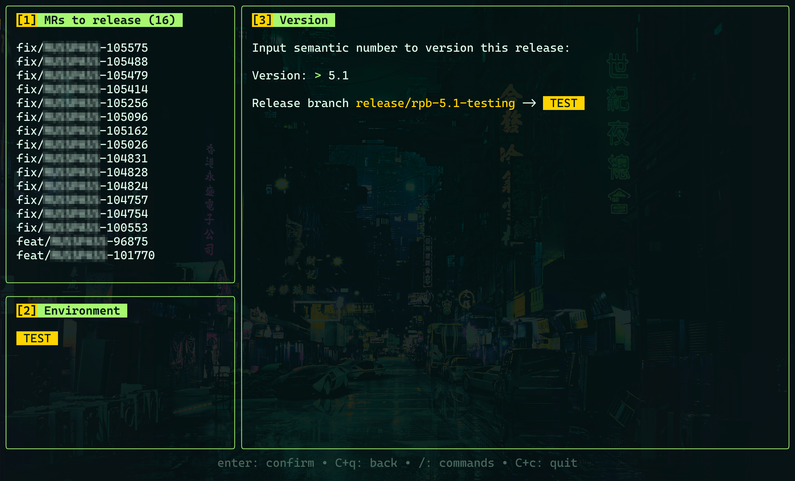

Type the version and press `Enter` to confirm.

---

## 5. Source Branch

Configure the source branch name where all selected MR branches will be merged before creating the environment release branch. If the branch does not exist locally or remotely, Relix will create it from the base branch.

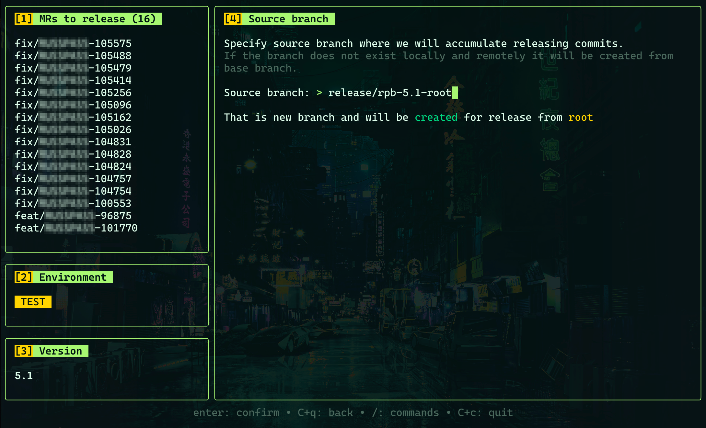

The screen indicates whether the branch already exists or will be newly created. Edit the branch name if needed and press `Enter` to continue.

---

## 6. Env Merge

Choose the merge strategy for delivering changes to the target environment branch. This step determines how commits from the source branch are applied to the environment branch.

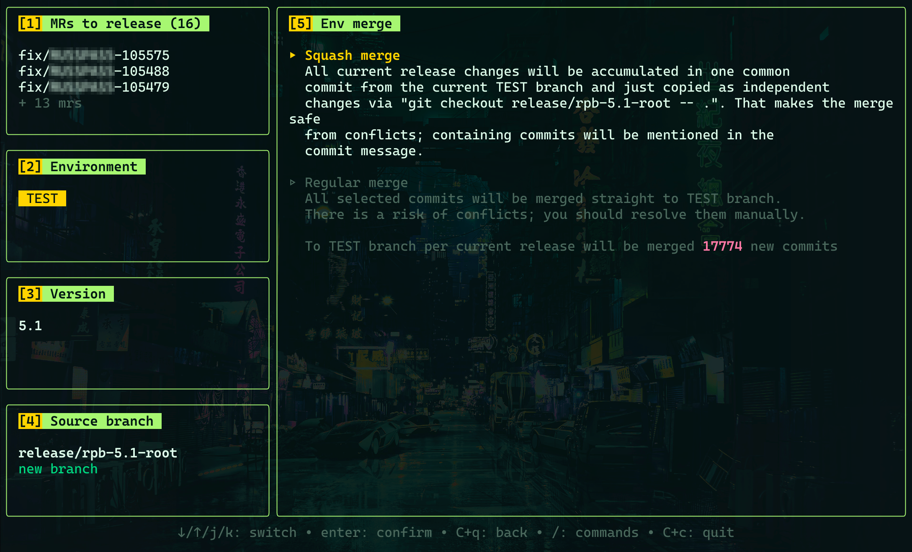

Two strategies are available:

- **Squash merge** -- All release changes are accumulated into a single commit on the environment branch. The content is copied from the source branch via `git checkout`, making this approach **safe from merge conflicts**. Commit messages from the original MRs are preserved in the squash commit message. This is the recommended default.

- **Regular merge** -- All selected commits are merged directly into the environment branch using a standard git merge. This preserves the full commit history but **carries a risk of merge conflicts** that you may need to resolve manually.

The screen also shows the total number of new commits that will be merged into the environment branch. Use `j` / `k` or arrow keys to switch between strategies, and press `Enter` to confirm.

---

## 7. Root Merge

Choose whether to merge the release branch back to the base (root) branch after the release is complete. This step controls whether the release is propagated back upstream.

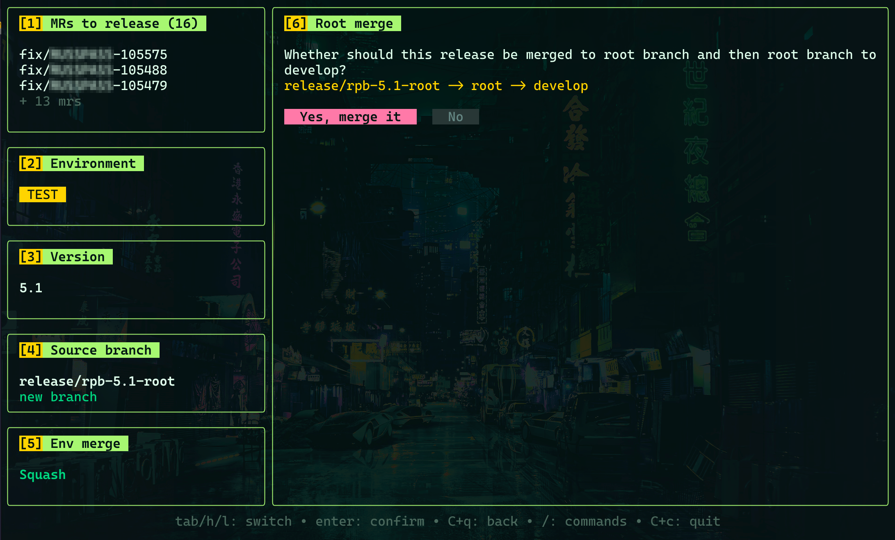

- **Yes, merge it** -- After the environment release, the source branch is merged back to the root branch, tagged with the release version, and then the root branch is merged into `develop`. This keeps all branches in sync.
- **No** -- Only the environment release is performed. The source branch is tagged but not merged back.

Use `Tab` or `h` / `l` to switch between options and `Enter` to confirm.

---

## 8. Confirmation

Before execution begins, Relix presents a complete summary of the release plan. Review every detail carefully:

- All selected MRs and their branches
- Target environment and branch
- Version number
- Source and base branches
- Env merge strategy
- Root merge preference
- Step-by-step description of what will happen

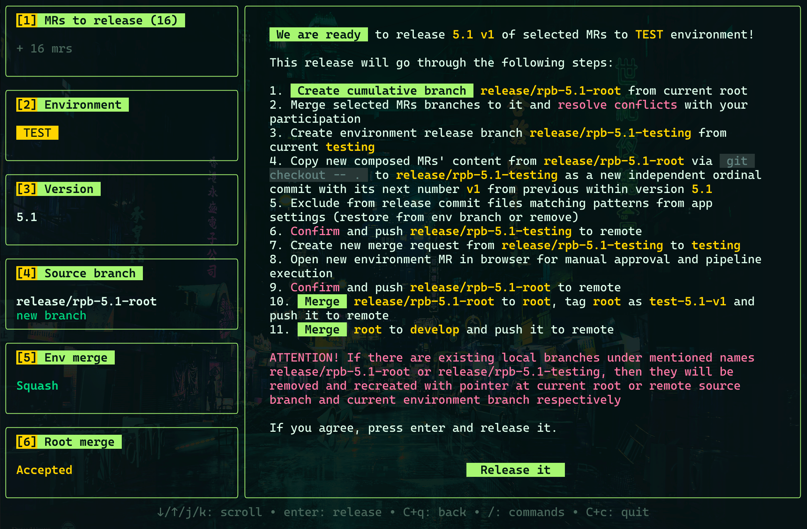

The screen also warns that existing local branches with the same release names will be removed and recreated. If everything looks correct, press `Enter` or click **Release it** to start the release.

---

## 9. Release Execution

Relix executes the release automatically, displaying real-time terminal output as each git command runs. A progress indicator at the top tracks the overall completion.

### Release Steps

The release proceeds through these steps in order:

1. **Git Fetch** -- Fetches the latest remote updates
2. **Checkout Source** -- Creates or restores the source branch from the base branch
3. **Merge Branches** -- Merges each selected MR branch into the source branch sequentially
4. **Checkout Environment** -- Creates the environment release branch from the current environment branch
5. **Copy Content** -- Replaces the environment branch content with the source branch content, applying file exclusions
6. **Commit** -- Creates the release commit with version metadata
7. **Push & Create MR** -- Pushes the environment release branch to remote and creates a GitLab Merge Request
8. **Push Root Branches** -- Tags the release, merges back to root and develop (if root merge is enabled)

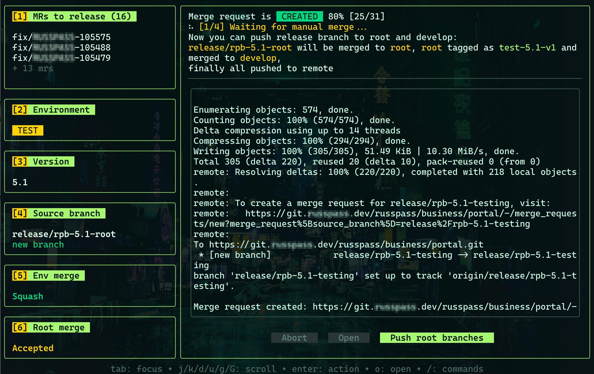

### Abort

You can abort the release at any point by pressing the **Abort** button. A confirmation modal appears to prevent accidental aborts. If confirmed, Relix resets your git state and saves the release to history with an "aborted" status.

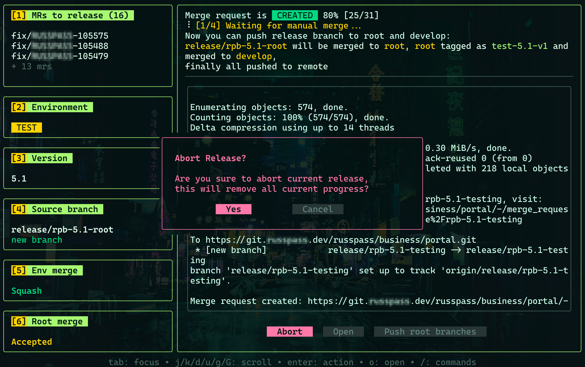

### Completion

When all steps finish successfully, the release is marked as **SUCCESSFULLY COMPLETED**. You can open the created MR in your browser or press **Complete** to return to the Home screen.

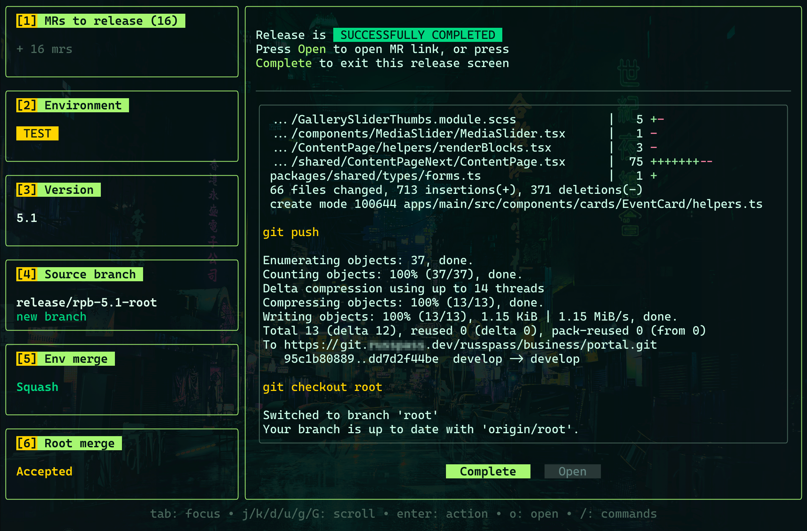

### Conflict Handling

If a merge conflict occurs during branch merging, the process pauses and waits for your intervention. Resolve the conflict in a separate terminal window, then press **Retry** in Relix to continue.

### Crash Recovery

Release state is automatically saved to `~/.relix/release.json` after each successful step. If Relix crashes or is closed mid-release, it will detect the saved state on the next launch and offer to resume exactly where you left off.

---

## 10. Release History

Access release history from the Home screen by pressing **`h`**. The history list shows all past releases with their tag, target environment, date, and MR count. Completed releases are marked with a green dot, aborted ones with a red dot.

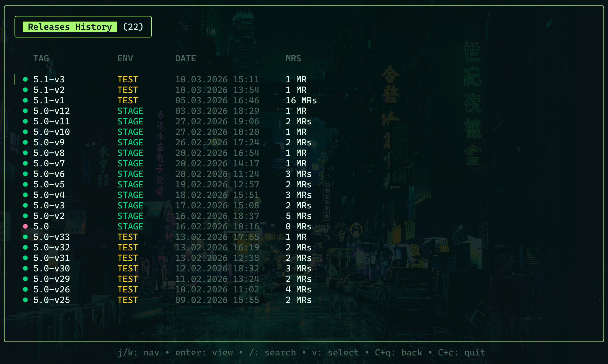

Select a release to view full details. The detail view has three tabs:

- **MRs** -- list of all MR branches included in the release. MR details are loaded on demand -- select a branch and press `r` to fetch its description, diff stats, and commits.

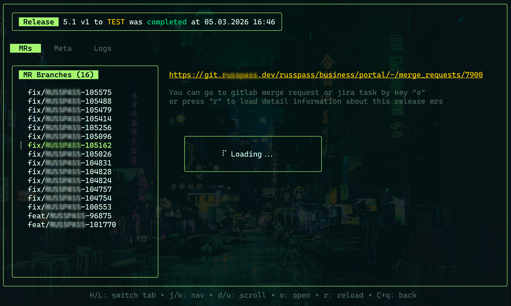

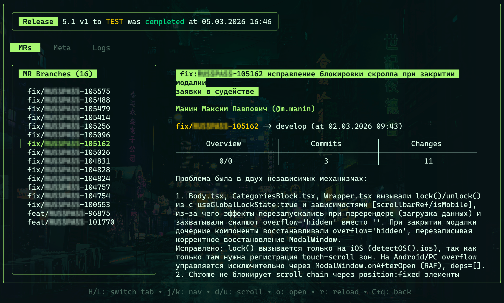

- **Meta** -- release metadata including date, environment, version, tag, status, branch names, and MR URL

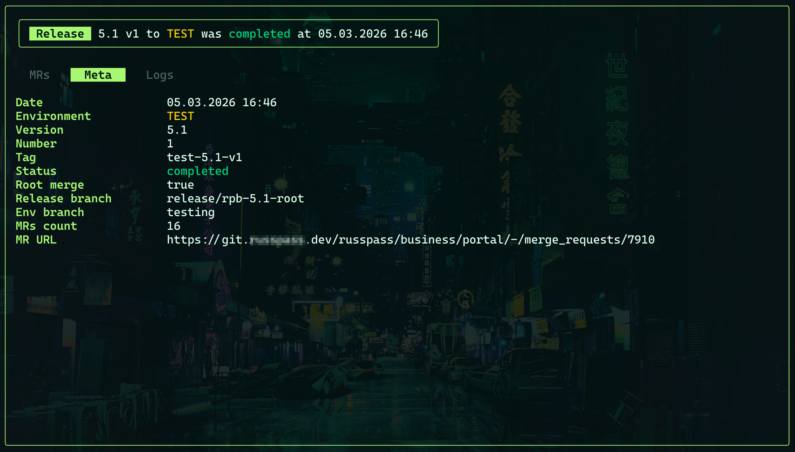

- **Logs** -- full terminal output captured during the release execution

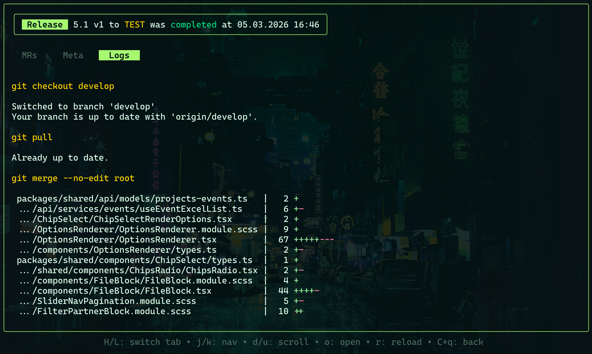

### Key Bindings

| Key | Action |
|-----|--------|
| `j` / `k` or `Up` / `Down` | Navigate the history list |
| `Enter` | View release details |
| `Space` | Toggle selection (for bulk deletion) |
| `o` | Open the release MR in your browser |
| `d` | Delete selected history entries |
| `H` / `L` | Switch between MRs / Meta / Logs tabs |

---

## 11. Global Shortcuts

These shortcuts are available throughout the application:

| Key | Action |
|-----|--------|
| `/` | Open Command Menu (project switch, settings, logout) |
| `Esc` | Go back to previous screen / Close modal |
| `Ctrl+c` | Quit the application |

---

## 12. Pipeline Monitoring

After the release MR is created on GitLab, Relix automatically monitors the associated pipeline:

- **Polls every 7 seconds** for pipeline and job status updates
- **Displays job statuses** in the release UI in real time
- **Sends macOS native notifications** when the pipeline completes (both success and failure)
- **Opens the MR** in your browser automatically for manual review and approval

This means you can switch away from Relix after the MR is created and still be notified when the pipeline finishes.

---

## See Also

- [Getting Started](getting-started.md) -- installation and first run
- [Configuration](configuration.md) -- environment and theme customization
- [Architecture](architecture.md) -- how Relix works internally
